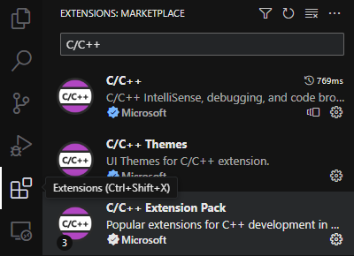
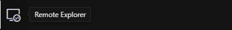
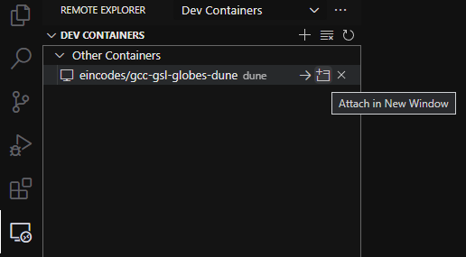
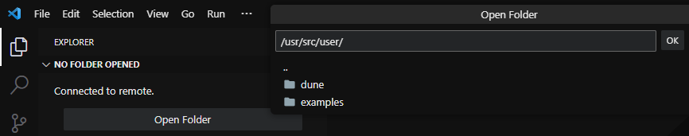

# Docker Image Repository GCC-GSL-GLOBES-CERN-ROOT-DUNE
> Available at: [Docker Hub: EinCodes/GCC-GSL-GLOBES-CERN-ROOT-DUNE](https://hub.docker.com/r/eincodes/gcc-gsl-globes-cern-root-dune)

[Portuguese Version](/readme.md)

Recipe for the Docker image to create containers containing the necessary dependencies for DUNE experiments, designed to assist UTFPR students and similar.

## [TL;DR](https://en.wikipedia.org/wiki/Wikipedia:Too_long;_didn%27t_read)

#### Creating the container:
1. Install Docker Desktop (https://www.docker.com/products/docker-desktop/) (Check minimum requirements)
2. Start the Docker Desktop executable (This needs to be running for docker commands to work)
3. Download this image via the terminal using the command `docker pull eincodes/gcc-gsl-globes-cern-root-dune`
4. Create a container from this image via the terminal using the command `docker create --name root_dune -it eincodes/gcc-gsl-globes-cern-root-dune`

#### Operating the container via Visual Studio Code (VSCode):
VSCode is a source code editor that has various tools for editing and executing code in various programming languages. Through it, it is possible to interact with the environment created by the container, as well as edit files and run commands in the terminal.

- Installation:
    1. Install Visual Studio Code (https://code.visualstudio.com/)
    2. Start the Visual Studio Code executable
    3. Install the following extensions:
        - [Visual Studio Code Marketplace • C/C++ Extension Pack](https://marketplace.visualstudio.com/items?itemName=ms-vscode.cpptools-extension-pack)
        - [Visual Studio Code Marketplace • Remote Explorer](https://marketplace.visualstudio.com/items?itemName=ms-vscode.remote-explorer)
        - [Visual Studio Code Marketplace • Dev Containers](https://marketplace.visualstudio.com/items?itemName=ms-vscode-remote.remote-containers)
        - [Visual Studio Code Marketplace • Docker](https://marketplace.visualstudio.com/items?itemName=ms-azuretools.vscode-docker)
          

- Operation:
    1. Start the Docker Desktop executable
    2. Start Visual Studio Code
    3. Access the [Remote Explorer](./assets/sample-03.png) button on the left sidebar
       
    4. Click the `Attach In New Window` button next to the root_dune container to open the container in a new window
      
    5. In the new window, click `Open Folder` to open a working folder (e.g., `/usr/src/user/`)
      

#### Operating the container via command line:
It is possible to interact with the environment created by the container in any terminal, but without the aid of any graphical interface. After starting the container in interactive mode, it is possible to edit, compile, and execute programs using only the command line, if experienced.

1. To start the container, use the command `docker start -i root_dune` (after that, it will be possible to use the command line of the environment)
2. To stop the container, **using the environment command line**, use the command `exit`
3. To stop the container, use the command `docker stop root_dune`

## How to use CERN ROOT in this container:
CERN ROOT was installed using the conda package manager, so it is only available when the conda main environment is activated (using the command `conda activate main`). However, switching to the conda main environment makes GSL and GLOBES unavailable. To switch back and make these libraries available again, use the command `conda deactivate`.

### How to switch to the conda main environment to enable CERN ROOT usage in the CLI:
- Run the command: `conda activate main`. This activates the main environment created by conda, which contains CERN ROOT.
- Now the `root` command is available for use, and you will see the `(main)` prefix in the CLI. Note that GSL and GLOBES are unavailable since it is a different environment.

### How to quit the conda main environment:
- Run the command: `conda deactivate`.

## Useful Directories
- /usr/src/user/examples/globes (e.g., `/usr/src/user/examples/globes/example1.sh`)
- /usr/src/user/dune (e.g., `/usr/src/user/dune/dune_globes/DUNE_GLoBES.glb`)

## Dependencies:
- GCC: 13.2.0
- GSL: 2.7.0
- GLOBES: 3.2.18
- CERN ROOT Version: latest from conda-forge

## Tested on:
Desktop:
- Intel Core i7-10700 2.90 GHz Processor
- 32GB DDR5 RAM & 2TB SSD M2
- Windows 11 Pro x64 (64 Bits)

Notebook:
- Intel Celeron N4000 1.10/2.60 GHz Processor
- 4GB DDR4 RAM & 256GB SSD M2
- Windows 11 Home Single Language x64 (64 Bits)

## License
The source code is licensed under the MIT license, which you can find in the MIT-LICENSE.txt file.
[MIT-LICENSE.txt](/MIT-LICENSE.txt)
